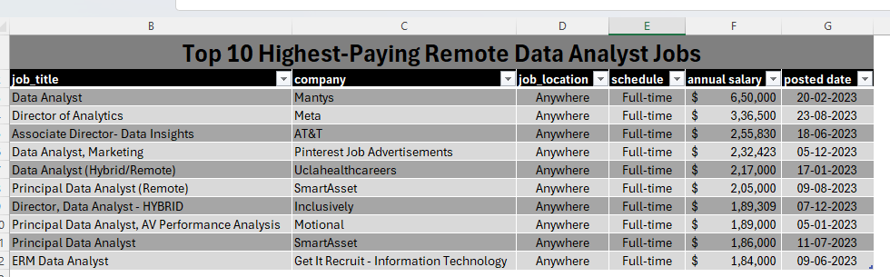
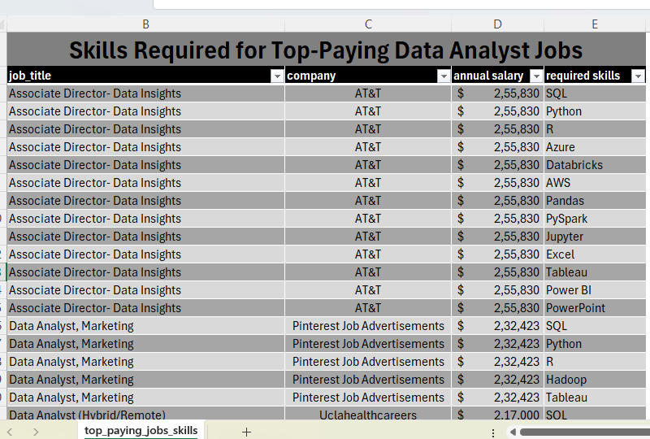
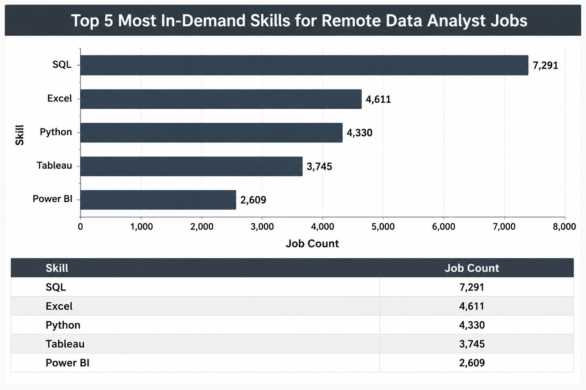
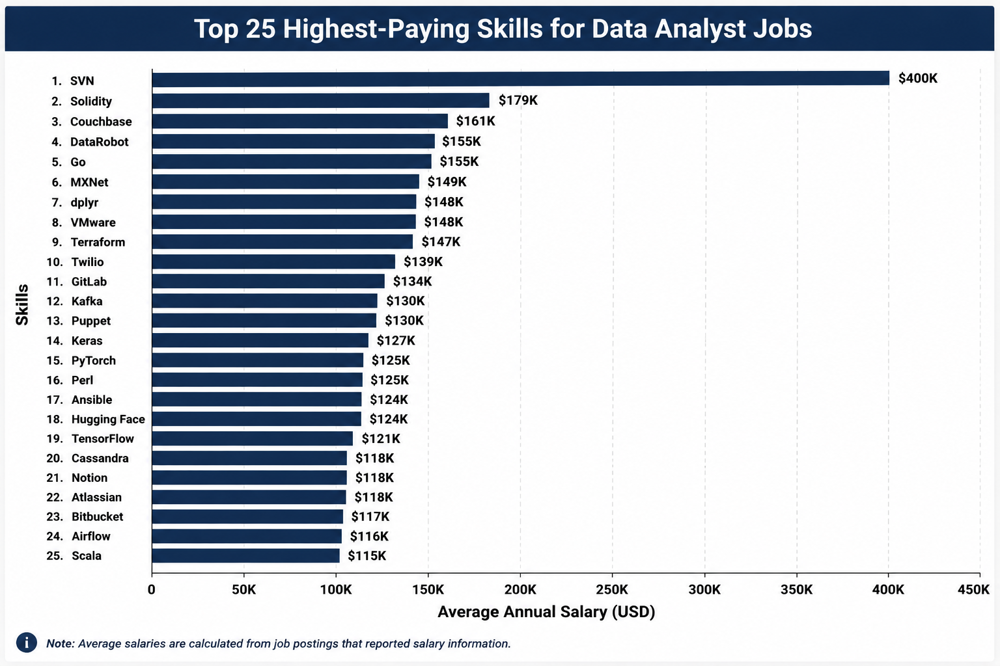
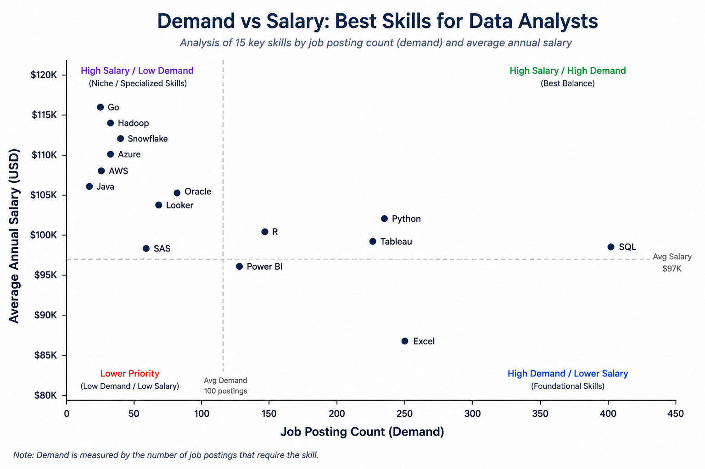

# 📊 Data Analyst Job Market Analysis Using SQL

## 📌 Project Overview

A SQL portfolio project exploring salary trends, skill demand, and hiring patterns in the remote Data Analyst job market using a real-world dataset containing over **3 million** job posting records.

# 📖 Introduction

Every day, thousands of companies post job openings for Data Analysts—but which skills actually lead to better salaries and stronger career opportunities?

This project uses SQL to analyze a real-world job market dataset containing **over 3 million job posting records**. By filtering, joining, and aggregating the data, the analysis identifies the highest-paying remote Data Analyst jobs, the most in-demand technical skills, and the skills that offer the best balance between salary and market demand.

The project answers five business-driven questions using PostgreSQL and demonstrates practical SQL concepts such as joins, aggregations, filtering, Common Table Expressions (CTEs), and data analysis workflows. It also reflects my hands-on experience with Git, GitHub, and Markdown while documenting a complete end-to-end SQL portfolio project.

## ❓ Business Questions

To better understand the remote Data Analyst job market, this project explores five key business questions through SQL analysis:

1. 💰 Which companies offer the highest-paying remote Data Analyst jobs?
2. 🛠️ What technical skills are required for these high-paying positions?
3. 📈 Which skills appear most frequently in remote Data Analyst job postings?
4. 💵 Which technical skills are associated with the highest average salaries?
5. 🎯 Which skills provide the best balance between market demand and earning potential?

## 🛠️ Tech Stack

This project combines SQL, database management, version control, and documentation tools to perform a complete end-to-end data analysis workflow.

| Technology | Purpose in Project |
|------------|--------------------|
| **SQL** | Queried, filtered, joined, and analyzed job posting data to answer key business questions. |
| **PostgreSQL** | Stored the dataset and executed SQL queries efficiently on a real-world job market database. |
| **Visual Studio Code** | Developed, tested, and organized SQL scripts in a structured development environment. |
| **Git** | Tracked changes and maintained version history throughout the project's development. |
| **GitHub** | Hosted the project, managed source code, and showcased the analysis as a portfolio project. |
| **Markdown** | Structured and documented the project through a clean, professional README. |
| **ChatGPT** | Assisted with learning SQL concepts, debugging queries, improving documentation, and refining project presentation. |

## 📁 Project Structure

The repository is organized into dedicated folders for datasets, database setup scripts, SQL queries, and project visualizations.

```text
sql_project_job_analysis/
│
├── 📄 README.md
├── 📄 .gitignore
│
├── 📂 assets
│   └── 📂 screenshots
│       ├── highest_paying_skills.png
│       ├── optimal_skills.png
│       ├── top_demanded_skills.png
│       ├── top_paying_job_skills.png
│       └── top_paying_jobs.png
│
├── 📂 csv_files
│   ├── company_dim.csv
│   ├── skills_dim.csv
│   └── skills_job_dim.csv
│
└── 📂 sql_load
    ├── 1_create_database.sql
    ├── 2_create_tables.sql
    ├── 3_modify_tables.sql
    │
    └── 📂 project_queries
        ├── 1_top_paying_jobs.sql
        ├── 2_top_paying_job_skills.sql
        ├── 3_top_demanded_skills.sql
        ├── 4_top_paying_skills.sql
        ├── 5_optimal_skills.sql
        └── optimal_skill.csv
```

### 📌 Repository Organization

- **README.md** → Provides an overview of the project, methodology, SQL analysis, visualizations, and key findings.
- **csv_files/** → Contains the datasets imported into PostgreSQL for analysis.
- **sql_load/** → Includes database setup scripts, analytical SQL queries, and supporting files used throughout the project.
- **.gitignore** → Excludes unnecessary files from version control, helping keep the repository clean and organized.

## 📂 Dataset Overview

This project analyzes a real-world Data Analyst job posting dataset.

The dataset contains information such as:

- 💼 Job titles
- 🏢 Company names
- 💰 Annual salaries
- 🌍 Job locations
- 🛠️ Required skills
- 📅 Job posting dates

The dataset was imported into PostgreSQL and analyzed using SQL to answer the project's key questions.

## 🧠 SQL Concepts Demonstrated

The analysis applies a range of SQL concepts to clean, transform, join, and summarize data in order to answer real-world business questions.

| SQL Concept | Purpose in Project |
|-------------|--------------------|
| **SELECT** | Retrieved relevant columns from the dataset for analysis. |
| **WHERE** | Filtered records based on salary, job title, work location, and other conditions. |
| **ORDER BY** | Ranked jobs and skills by salary and market demand. |
| **GROUP BY** | Aggregated data to identify salary trends and skill demand. |
| **JOIN** | Combined multiple tables to connect job postings with required skills. |
| **Aggregate Functions** | Calculated averages, counts, and summary statistics. |
| **Common Table Expressions (CTEs)** | Simplified complex queries by breaking them into logical steps. |
| **Aliases** | Improved query readability and made SQL statements easier to understand. |
| **LIMIT** | Returned a subset of records for efficient query development and result inspection. |

> **Note:** While developing queries, `LIMIT` was frequently used to preview and validate results efficiently before analyzing the complete filtered dataset.

## 💰 1. Highest-Paying Remote Data Analyst Jobs

### 🎯 Objective

Identify the highest-paying remote Data Analyst jobs and the companies offering them.

### 📄 SQL Query

🔗 **View SQL File:** [1_top_paying_jobs.sql](sql_load/project_queries/1_top_paying_jobs.sql)

### 📊 Results



### 💡 Insights

- The highest-paying remote Data Analyst positions offer salaries exceeding **$650,000**.
- A relatively small number of companies offer exceptionally high compensation.
- Salary varies significantly across employers, highlighting the importance of company selection.
- Remote opportunities can provide highly competitive compensation packages.

### ✅ Key Takeaway

The analysis shows that the highest-paying remote Data Analyst roles are concentrated among a relatively small number of companies, emphasizing the value of specialized skills and strategic job selection.

## 🛠️ 2. Skills Required for the Highest-Paying Remote Data Analyst Jobs

### 🎯 Objective

Identify the technical skills and tools most commonly required for the highest-paying remote Data Analyst jobs.

### ❓ Business Question

What skills are employers looking for in the highest-paying remote Data Analyst positions?

### 📄 SQL Query

🔗 **View SQL File:**  [2_top_paying_job_skills.sql](sql_load/project_queries/2_top_paying_job_skills.sql)

### 📊 Results



*Figure 2. Required skills associated with the highest-paying remote Data Analyst jobs in the dataset.*

### 💡 Insights

- SQL and Python consistently appear among the required skills for the highest-paying Data Analyst positions.
- Cloud platforms such as AWS and Azure are frequently associated with premium-paying analytics roles.
- Big data technologies like Databricks and PySpark indicate strong demand for candidates with large-scale data processing experience.
- Business intelligence tools including Tableau and Power BI remain valuable skills for high-paying analytical positions.
- Employers seek a combination of programming, cloud computing, data visualization, and database management skills rather than relying on a single technical expertise.

### ✅ Key Takeaway

The highest-paying remote Data Analyst jobs require a diverse technical skill set that combines SQL, programming languages, cloud technologies, and business intelligence tools, highlighting the importance of developing a well-rounded analytics toolkit.

## 📈 3. Most In-Demand Skills for Remote Data Analyst Jobs

### 🎯 Objective

Identify the technical skills that appear most frequently in remote Data Analyst job postings.

### ❓ Business Question

Which skills are most in demand for remote Data Analyst jobs?

### 📄 SQL Query

🔗 **View SQL File:** [3_top_demanded_skills.sql](sql_load/project_queries/3_top_demanded_skills.sql)

### 📊 Results



*Figure 3. Top five most in-demand skills for remote Data Analyst jobs based on job posting count.*

### 💡 Insights

- SQL is the most in-demand skill, appearing in **7,291** remote Data Analyst job postings.
- Excel ranks second with **4,611** postings, showing that spreadsheet skills remain highly relevant in analytics roles.
- Python appears in **4,330** postings, confirming its importance for data analysis, automation, and advanced analytics.
- Tableau and Power BI are both among the top five skills, highlighting the strong demand for data visualization and business intelligence capabilities.
- The results show that employers value a combination of database querying, spreadsheet analysis, programming, and visualization skills.

### ✅ Key Takeaway

SQL is the strongest foundational skill for remote Data Analyst roles, while Excel, Python, Tableau, and Power BI together form a practical and highly employable analytics toolkit.

## 💵 4. Highest-Paying Skills for Data Analyst Jobs

### 🎯 Objective

Identify the technical skills associated with the highest average salaries for Data Analyst jobs.

### ❓ Business Question

Which technical skills command the highest average salaries in Data Analyst job postings?

### 📄 SQL Query

🔗 **View SQL File:** [4_top_paying_skills.sql](sql_load/project_queries/4_top_paying_skills.sql)

### 📊 Results



*Figure 4. Top 25 highest-paying technical skills based on the average annual salary reported in Data Analyst job postings.*

> **Note:** Average salaries are calculated only from job postings that reported salary information.

### 💡 Insights

- **SVN** ranks as the highest-paying skill with an average annual salary of approximately **$400,000**, although it appears in a relatively small number of job postings.
- Emerging and specialized technologies such as **Solidity**, **Couchbase**, **DataRobot**, and **Go** also command exceptionally high average salaries.
- Cloud infrastructure and DevOps tools including **Terraform**, **GitLab**, and **Kafka** are among the highest-paying skills, reflecting strong demand for modern data engineering capabilities.
- Machine learning frameworks such as **PyTorch**, **TensorFlow**, and **Keras** appear among the top-paying skills, highlighting the growing value of AI and advanced analytics expertise.
- Many of the highest-paying skills are specialized technologies, suggesting that niche technical expertise often leads to premium compensation.

### ✅ Key Takeaway

Specialized technical skills generally command the highest salaries in the Data Analyst job market. While foundational skills remain essential, developing expertise in cloud platforms, machine learning frameworks, and modern data infrastructure can significantly increase earning potential.

## 🎯 5. Optimal Skills for Data Analysts

### 📌 Objective

Analyze both **job demand** and **average salary** to identify the skills that provide the best balance between market demand and earning potential for remote Data Analyst roles.

---

### ❓ Business Question

> Which skills offer the best combination of **high demand** and **high salary** for aspiring Data Analysts?

---

### 💻 SQL Query

🔗 **View SQL File:** [5_optimal_skills.sql](sql_load/project_queries/5_optimal_skills.sql)

---

### 📊 Skill Demand vs Salary Analysis



---

### 🔍 Insights

- **SQL** stands out as the most valuable Data Analyst skill, combining the **highest job demand** with a competitive average salary.
- **Python** provides one of the strongest balances between salary and demand, making it an essential programming language for data professionals.
- **Tableau**, **Power BI**, and **R** remain highly sought-after analytical tools, reflecting the industry's growing focus on data visualization and business intelligence.
- Cloud technologies such as **AWS**, **Azure**, and **Snowflake** command premium salaries despite appearing in fewer job postings, making them excellent specialization skills.
- **Excel** continues to be one of the most frequently requested skills, reinforcing its importance as a core business and analytical tool.

---

### ✅ Key Takeaway

The analysis demonstrates that the most valuable skills are not necessarily those with the highest salaries, but those that offer the best balance between **market demand** and **earning potential**.

For aspiring Data Analysts, an effective learning roadmap would be:

**SQL → Python → Excel → Tableau / Power BI → Cloud Technologies (AWS, Azure, Snowflake)**

Building a strong foundation in these technologies significantly improves both employability and long-term career growth in data analytics.

# 🏁 Conclusion

This project explored the remote Data Analyst job market through SQL by analyzing a large real-world dataset containing millions of job posting records. By answering five business-driven questions, the analysis uncovered meaningful insights into salary trends, employer expectations, and the technical skills most valued in today's data analytics industry.

The findings reveal several consistent patterns:

- 💰 High-paying Data Analyst roles are concentrated among a relatively small number of companies.
- 🛠️ Top-paying positions require a well-rounded technical skill set rather than expertise in a single tool.
- 📈 SQL, Python, Excel, Tableau, and Power BI consistently appear as the most valuable core skills for aspiring Data Analysts.
- 💵 Specialized technologies such as cloud platforms and advanced analytics tools can command premium salaries but generally appear less frequently in job postings.
- 🎯 The strongest long-term career opportunities come from building a balanced skill set that combines high-demand foundational technologies with specialized expertise.

Beyond the business insights, this project strengthened my ability to work with SQL in a practical setting by writing analytical queries, joining multiple tables, aggregating data, filtering large datasets, and transforming raw information into actionable insights. It also provided hands-on experience with PostgreSQL, Git, GitHub, and Markdown while documenting an end-to-end data analysis project.

Overall, this project demonstrates how SQL can be used not only to query data, but also to solve real-world business problems and support data-driven decision-making.

## 🚀 Future Improvements

While this project focuses on SQL-based analysis, there are several opportunities to expand it further:

- Build an interactive Power BI dashboard to visualize the findings.
- Automate the data analysis workflow using Python.
- Analyze additional job roles such as Data Scientist and Data Engineer.
- Perform trend analysis across different industries and geographic regions.
- Develop an end-to-end data pipeline for automated reporting.


### 📚 Dataset Source

The dataset used in this project was provided as part of Luke Barousse's SQL for Data Analytics course and is used for educational and portfolio purposes.

> **Note:** The original `job_postings_fact.csv` file is not included because its size exceeds GitHub's standard file limit. It was imported locally into PostgreSQL and used throughout the analysis.